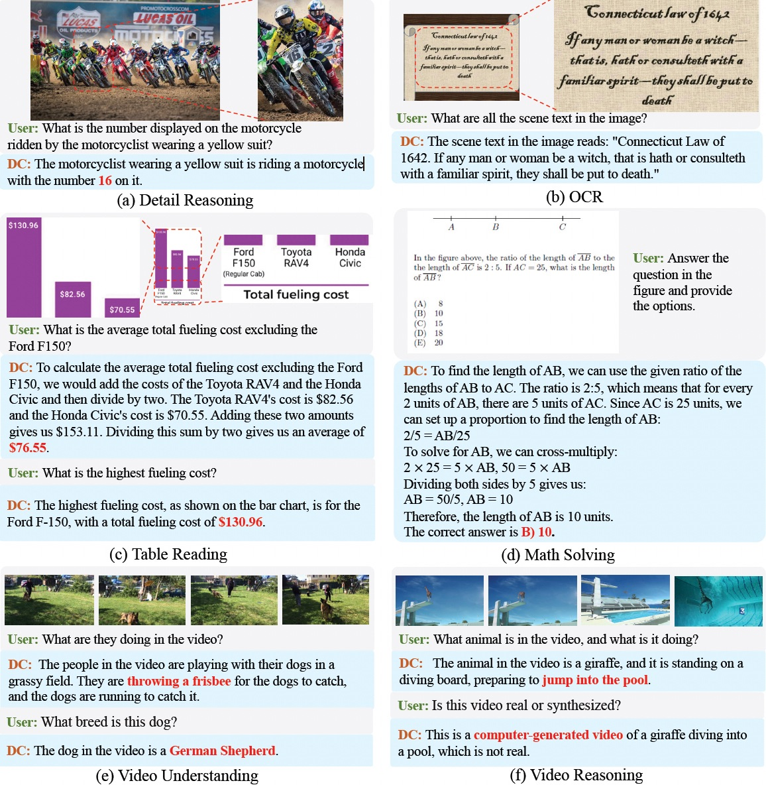

<div align="center">

<h1> Dense Connector for MLLMs </h1>

<h5 align="center"> 

<a href='https://arxiv.org/abs/2405.13800'></a>
<a href='https://huggingface.co/collections/HuanjinYao/denseconnector-66500e173fc8c9f05dc98dea'></a>
[](https://zhuanlan.zhihu.com/p/700000183)
<a href='https://huggingface.co/spaces/HuanjinYao/DenseConnector-v1.5-8B'></a>


[Huanjin Yao](https://scholar.google.com/citations?user=pDtsCBQAAAAJ&hl=zh-CN)<sup>1,3*</sup>,
[Wenhao Wu](https://whwu95.github.io/)<sup>2*✉️</sup>,
[Taojiannan Yang]()<sup>4</sup>,
[Yuxin Song]()<sup>3</sup>,
[Mengxi Zhang](https://scholar.google.com/citations?user=73tAoEAAAAAJ&hl=en)<sup>3</sup>,
[Haocheng Feng]()<sup>3</sup>,
[Yifan Sun]()<sup>3</sup>,

[Zhiheng Li](https://www.sigs.tsinghua.edu.cn/lzh/main.htm)<sup>1</sup>,
[Wanli Ouyang](https://wlouyang.github.io/)<sup>5</sup>,
[Jingdong Wang](https://jingdongwang2017.github.io/)<sup>3</sup>


<sup>1</sup>[Tsinghua University](https://www.tsinghua.edu.cn/en/), <sup>2</sup>[The University of Sydney](https://www.sydney.edu.au/), <sup>3</sup>[Baidu](https://vis.baidu.com/#/), <sup>4</sup>[AWS AI Labs](https://aws.amazon.com/ai/), <sup>5</sup>[CUHK](https://www.cuhk.edu.hk/english/index.html#)

<sup>*</sup>Equal Contribution,       <sup>✉️</sup>Corresponding Author

</h5>
</div>

***

## News 
- [x] **[2024/05/24]** Special thanks to [@_akhaliq](https://x.com/_akhaliq/status/1793863100002714003) for promptly sharing our work on Twitter! 
- [x] **[2024/05/24]** We relase **Dense Connector** in [arxiv](https://arxiv.org/abs/2405.13800)! The code and [models](https://github.com/HJYao00/DenseConnector/blob/main/docs/ModelZoo.md) are now open source!


## Contents
- [News](#news)
- [Contents](#contents)
- [Overview](#overview)
- [Installation](#installation)
- [Dataset Preparation and Training](#dataset-preparation-and-training)
- [Evaluation](#evaluation)
- [Model Zoo](#model-zoo)
- [Dialogue Example](#dialogue-example)
- [Citation](#citation)
- [Acknowledgment](#acknowledgment)


## Overview

We introduce the Dense Connector - a simple, effective, and plug-and-play vision-language connector that significantly enhances existing MLLMs by leveraging multi-layer visual features, with minimal additional computational overhead! We hope that this work will provide valuable experience and serve as a basic module for future MLLM development!
<div align=center>

</div>

The Dense Connector utilizes multi-layer visual features to enhance visual representation and augment the visual perception capabilities of the Multimodal Large Language Models (MLLMs) which can be easily integrated into the current MLLMs. We provide three instantiation methods of Dense Connector: Sparse Token Integration (STI), Sparse Channel Integration (SCI), and Dense Channel Integration (DCI). The Dense Channel Integration achieves the best results.

<div align=center>

</div>

## Installation
Please follow the instructions below to install the required packages.

1. Clone this repository
```bash
git clone https://github.com/HJYao00/DenseConnector.git
cd DenseConnector
```

2. Install Package
```bash
conda create -n dc python=3.10 -y
conda activate dc
cd DenseConnector
pip install --upgrade pip 
pip install -e .
```

3. Install additional packages for training Dense Connector
```bash
pip install ninja
pip install flash-attn --no-build-isolation
```

## Dataset Preparation and Training
Please refer to the [document](https://github.com/HJYao00/DenseConnector/blob/main/docs/Dataset_Training.md) for dataset preparation and training.

## Evaluation
We evaluate the Dense Connector across 19 diverse benchmarks, including 11 image benchmarks and 8 video benchmarks. The testing procedures for both images and videos can be found [here](https://github.com/HJYao00/DenseConnector/blob/main/docs/Evaluation.md).

## Model Zoo
Please visit our [Model Zoo](https://github.com/HJYao00/DenseConnector/blob/main/docs/ModelZoo.md) to access all publicly available Dense Connector checkpoints. 
We scale the LLM from 2.7B to 70B, incorporating the latest open-source large language model, Llama3-8B-Instruct & Llama3-70B-Instruct

## Dialogue Example

We provide several dialogue examples, with additional results available in the [paper](https://arxiv.org/abs/2405.13800).

<div align=center>

</div>

## Citation
If you find this repository is useful, please consider star🌟 this repo and cite🖇️ our paper.
```bibtex
@article{yao2024dense,
  title={Dense Connector for MLLMs},
  author={Yao, Huanjin and Wu, Wenhao and Yang, Taojiannan and Song, YuXin and Zhang, Mengxi and Feng, Haocheng and Sun, Yifan and Li, Zhiheng and Ouyang, Wanli and Wang, Jingdong},
  journal={arXiv preprint arXiv:2405.13800},
  year={2024}
}
```

## Acknowledgment

We extend our gratitude to the open-source efforts of [LLaVA](https://github.com/haotian-liu/LLaVA), [Mini-Gemini](https://github.com/dvlab-research/MGM) and [FreeVA](https://github.com/whwu95/FreeVA).
