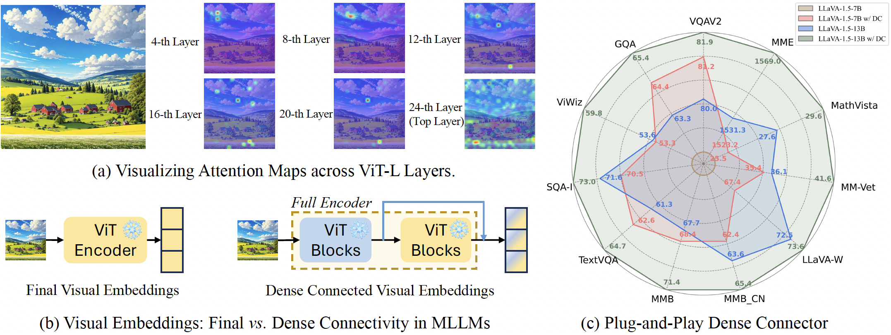
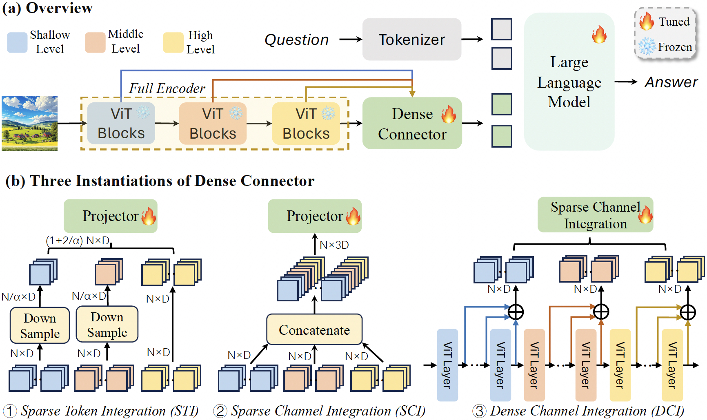

<div align="center">

<h1> Dense Connector for MLLMs </h1>

<h5 align="center"> 
  
</h5>
</div>

<div align=center>

</div>

## 🗺️ Overview

The Dense Connector utilizes multi-layer visual features to enhance visual representation and augment the visual perception capabilities of the Multimodal Large Language Models (MLLMs) which can be easily integrated into the current MLLMs. We provide three instantiation methods of Dense Connector: Sparse Token Integration (STI), Sparse Channel Integration (SCI), and Dense Channel Integration (DCI). The Dense Channel Integration achieves the best results.

<div align=center>

</div>

## Installation
Please follow the instructions below to install the required packages.

1. Clone this repository

2. Install Package
```bash
conda create -n dc python=3.10 -y
conda activate dc
cd DenseConnector
pip install --upgrade pip 
pip install -e .
```

3. Install additional packages for training Dense Connector
```bash
pip install ninja
pip install flash-attn --no-build-isolation
```

## Data
We utilize the publicly available datasets [LLaVA-1.5](https://github.com/haotian-liu/LLaVA/tree/main) and [Mini-Gemini](https://github.com/dvlab-research/MGM/tree/main). Please prepare the datasets in accordance with the official guidelines.

## Train

Our models are trained on 8 A100 GPUs with 80GB memory. To train on fewer GPUs, you can reduce the `per_device_train_batch_size` and increase the `gradient_accumulation_steps` accordingly. Always keep the global batch size the same: `per_device_train_batch_size` x `gradient_accumulation_steps` x `num_gpus`.

Adjust values `--mm_dense_connector_type` and `--vision_tower` to modify the instantiation of the Dense Connector and visual encoder. For `--mm_dense_connector_type`, we support options 'sti', 'sci' and 'dci'. For `--vision_tower`, the available options are 'openai/clip-vit-large-patch14-336' and 'google/siglip-so400m-patch14-384'.

- `--mm_dense_connector_type dci`: The instantiation of the Dense Connector.
- `--vision_tower openai/clip-vit-large-patch14-336`: Visual Encoder

### Pre-train

We employ DeepSpeed ZERO-2 for pre-training. Please execute the following command to train the Dense Connector on A100 GPUs:

```
sh scripts/v1_5/pretrain.sh
```

<details>
<summary>In addition, we support training Vicuna-7B & 13B parameters using 32G V100 GPUs, facilitated by xformers</summary>

Please run the following command to train on V100 GPUs:

```
sh scripts/v1_5/pretrain_v100.sh
```

</details>

### Instruction Tuning

We use DeepSpeed ZERO-3 for Visual Instruction Tuning. For the Hermes-2-Yi-34B and Llama-3-70B-Instruct, we utilize LoRA for fine-tuning large language models, and we use full fine-tuning for Phi2-2.7B, Vicuna 7&13B and Llama3-8B-Instruct.

To full fine-tuning models for stage 2, you can run the following command:
```
sh scripts/v1_5/vicuna_v1/train/finetune.sh
```
You can also refer to the following script to train the model using LoRA to reduce the training memory:
```
sh scripts/v1_5/llama_3/train/finetune_lora.sh
```
